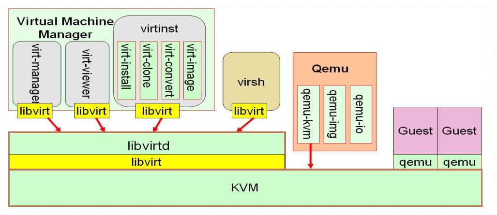

# 一、KVM工具栈



> 上图主要描述了kvm的主要工具栈，从大的类别可以分为libvirt和qumu这两大类，其中libvirt中分virtual machine manager和virsh，virtual machine manager中的virt-manager是基于图形界面的管理，其他都是可以在命令行直接使用命令来管理虚拟机；virsh是基于终端命令行管理；两者都是通过libvirt连接至libvirtd进行管理；而对qemu来说，它管理虚拟机是直接调用内核中的kvm模块API进行管理；

# 二、virsh工具的使用

## 1. 查看virsh命令帮助信息

```
[root@node1 ~]# virsh help
```

> 从帮助信息可以看到，virsh命令大概分了：Domain Management(域管理)，Domain Monitoring(域监控)，Host and Hypervisor(主机及虚拟化)，Interface(网卡接口)，Network Filter(网络防火墙)，Networking(网络)，Node Device(节点驱动设备)，Secret，Snapshot(快照)，Storage Pool(存储池或存储策略)，Storage Volume(存储卷)，Virsh itself(virsh shell 自身相关)。

>  查看某一组帮助信息，可以使用virsh help +组名；
>
> 查看某个命令的用法，可以使用virsh help +命令；

## 2. virsh管理虚拟机

### `virsh list`

列出当前宿主机上的虚拟机列表，默认不加任何选项表示列出当前处于运行状态的虚拟机列表。

```
[root@node1 ~]# virsh help list 
  NAME
    list - 列出域
 
  SYNOPSIS
    list [--inactive] [--all] [--transient] [--persistent] [--with-snapshot] [--without-snapshot] [--state-running] [--state-paused] [--state-shutoff] [--state-other] [--autostart] [--no-autostart] [--with-managed-save] [--without-managed-save] [--uuid] [--name] [--table] [--managed-save] [--title]
 
  DESCRIPTION
    返回域列表
 
  OPTIONS
    --inactive       列出不活跃的域
    --all            不活跃和活跃的域列表
    --transient      列出临时域
    --persistent     列出持久域
    --with-snapshot  列出现有快照的域
    --without-snapshot  列出没有快照的域
    --state-running  运行状态的域列表
    --state-paused   列出暂停状态的域
    --state-shutoff  列出关闭状态的域
    --state-other    列出其他状态的域
    --autostart      列出启用 autostart 的域
    --no-autostart   列出禁用 autostart 的域
    --with-managed-save  列出有管理的保存状态的域
    --without-managed-save  列出没有管理的保存状态的域
    --uuid           只列出 uuid
    --name           只列出域名
    --table          列出表格（默认）
    --managed-save   标记有管理的保存状态的域
    --title          show domain title
```

### `virsh create`

从一个XML文件创建一个域(虚拟机)

```
[root@node1 ~]# virsh help create
  NAME
    create - 从一个 XML 文件创建一个域
 
  SYNOPSIS
    create <file> [--console] [--paused] [--autodestroy] [--pass-fds <string>] [--validate]
 
  DESCRIPTION
    创建一个域
 
  OPTIONS
    [--file] <string>  文件包括一个 XML 域描述
    --console        创建后附加到控制台
    --paused         生成后让虚拟机保持暂停状态
    --autodestroy    virsh 断开连接时自动销毁虚拟机
    --pass-fds <string>  向虚拟机传递文件描述符 N、M......
    --validate       validate the XML against the schema
```

### `virsh define`

从指定配置文件中创建虚拟机，但不运行，create是创建并运行；

```
[root@node1 ~]# virsh help define
  NAME
    define - 从一个 XML 文件定义（但不开始）一个域
 
  SYNOPSIS
    define <file> [--validate]
 
  DESCRIPTION
    定义一个域。
 
  OPTIONS
    [--file] <string>  文件包括一个 XML 域描述
    --validate       validate the XML against the schema
```

### `virsh shutdown`

关闭指定虚拟机

```
[root@node1 ~]# virsh help shutdown
  NAME
    shutdown - 关闭一个域
 
  SYNOPSIS
    shutdown <domain> [--mode <string>]
 
  DESCRIPTION
    在目标域中执行关闭行为。
 
  OPTIONS
    [--domain] <string>  domain name, id or uuid
    --mode <string>  shutdown mode: acpi|agent|initctl|signal|paravirt
```

> 提示：使用shutdown子命令，有时候会关不掉，我们需要使用destroy子命令来强制关机

> 提示：强制删除有点类似我们使用kill -9强制杀死一个进程一样，其实kvm上的虚拟在宿主机机上的表现形式就是一个进程，如下所示；
>
> 

> 提示：我们在宿主机上查看进程就可以知道当前宿主机上就运行了台虚拟机，从上面的信息我们也不难理解virsh其实也就是调用qemu来创建虚拟机的；

### `virsh start`

启动指定非活动的虚拟机(开机)

```
[root@node1 ~]# virsh help start
  NAME
    start - 开始一个（以前定义的）非活跃的域
 
  SYNOPSIS
    start <domain> [--console] [--paused] [--autodestroy] [--bypass-cache] [--force-boot] [--pass-fds <string>]
 
  DESCRIPTION
    启动域，可以从最后一个 managedsave
  state，如果没有 managedsave state，
    也可以从全新引导中启动。
 
  OPTIONS
    [--domain] <string>  非活跃域的名称
    --console        创建后附加到控制台
    --paused         生成后让虚拟机保持暂停状态
    --autodestroy    virsh 断开连接时自动销毁虚拟机
    --bypass-cache   载入时避免文件系统缓存
    --force-boot     采用忽略所有管理保存的方式强制刷新引导
    --pass-fds <string>  向虚拟机传递文件描述符 N、M......
```

### `virsh suspend`

挂起虚拟机

```
[root@node1 ~]# virsh help suspend
  NAME
    suspend - 挂起一个域
 
  SYNOPSIS
    suspend <domain>
 
  DESCRIPTION
    挂起一个运行的域。
 
  OPTIONS
    [--domain] <string>  domain name, id or uuid
```

> 提示：suspend操作是把指定虚拟机挂起，所谓挂起就是把运行状态的虚拟机暂停，并把当前运行状态保存到内存，有点类似时间停止的感觉，外部客户端对它访问它也不会响应；如果此时宿主机掉电，那么之前保存在内存的运行状态数据也将随之丢失；

### `virsh resume`

恢复指定被挂起的虚拟机

```
[root@node1 ~]# virsh help resume
  NAME
    resume - 重新恢复一个域
 
  SYNOPSIS
    resume <domain>
 
  DESCRIPTION
    重新恢复一个以前被挂起的域。
 
  OPTIONS
    [--domain] <string>  domain name, id or uuid
```

### `virsh save`

把指定的虚拟机运行状态信息保存至指定文件，有点类似vmware 中的挂起操作，vmware的挂起操作是把运行状态保存到磁盘，宿主机掉电，它不会的丢失数据；

```
[root@node1 ~]# virsh help save
  NAME
    save - 把一个域的状态保存到一个文件
 
  SYNOPSIS
    save <domain> <file> [--bypass-cache] [--xml <string>] [--running] [--paused] [--verbose]
 
  DESCRIPTION
    保存运行中的域 的 RAM 状态
 
  OPTIONS
    [--domain] <string>  domain name, id or uuid
    [--file] <string>  数据存到什么地方
    --bypass-cache   保存时避免文件系统缓存
    --xml <string>   包含为目标更新的 XML 的文件名
    --running        设定要在还原中运行的域
    --paused         设定要在还原中暂停的域
    --verbose        显示保存进程
```

### `virsh restore`

从指定文件恢复虚拟机(该文件是使用save命令保存下来的虚拟机运行状态信息文件)

```
[root@node1 ~]# virsh help restore
  NAME
    restore - 从一个存在一个文件中的状态恢复一个域
 
  SYNOPSIS
    restore <file> [--bypass-cache] [--xml <string>] [--running] [--paused]
 
  DESCRIPTION
    恢复一个域。
 
  OPTIONS
    [--file] <string>  恢复的状态
    --bypass-cache   恢复时避免文件系统缓存
    --xml <string>   包含为目标更新的 XML 的文件名
    --running        将域恢复为运行状态
    --paused         将域恢复为暂停状态
```

### `virsh reboot`

重启指定虚拟机，如同在指定虚拟机上执行reboot命令一样；

```
[root@node1 ~]# virsh help reboot
  NAME
    reboot - 重新启动一个域
 
  SYNOPSIS
    reboot <domain> [--mode <string>]
 
  DESCRIPTION
    在目标域中执行重新启动命令。
 
  OPTIONS
    [--domain] <string>  domain name, id or uuid
    --mode <string>  shutdown mode: acpi|agent|initctl|signal|paravirt
```

### `virsh reset`

对指定虚拟机执行强制重启，有点类似按机箱上的重置按钮；

```
[root@node1 ~]# virsh help reset
  NAME
    reset - 重新设定域
 
  SYNOPSIS
    reset <domain>
 
  DESCRIPTION
    如同使用电源按钮重新设定目标域
 
  OPTIONS
    [--domain] <string>  domain name, id or uuid
```

### `virsh dumpxml`

以xml格式输出指定虚拟机的详细配置（把对应虚拟机的配置文件内容输出到标准输出）；

```
[root@node1 ~]# virsh help dumpxml
  NAME
    dumpxml - XML 中的域信息
 
  SYNOPSIS
    dumpxml <domain> [--inactive] [--security-info] [--update-cpu] [--migratable]
 
  DESCRIPTION
    把域信息作为一个 XML 输出到 stdout。
 
  OPTIONS
    [--domain] <string>  domain name, id or uuid
    --inactive       显示不活跃定义的 XML
    --security-info  包括 XML 转储中与安全性相关的信息
    --update-cpu     根据主机 CPU 更新虚拟机 CPU
    --migratable     为迁移提供 XML 可用性
```

### `virsh undefine`

删除指定虚拟机(会连同配置文件一并删除)

```
[root@node1 ~]# virsh help undefine
  NAME
    undefine - 取消定义一个域
 
  SYNOPSIS
    undefine <domain> [--managed-save] [--storage <string>] [--remove-all-storage] [--delete-snapshots] [--wipe-storage] [--snapshots-metadata] [--nvram] [--keep-nvram]
 
  DESCRIPTION
    取消定义一个域或者将持久转换为临时。
 
  OPTIONS
    [--domain] <string>  domain name, id or uuid
    --managed-save   删除域管理的状态文件
    --storage <string>  删除关联的存储卷（用逗号分开的目标或者源路径列表）（查看 domblklist）
    --remove-all-storage  删除关联的存储卷（小心使用）
    --delete-snapshots  delete snapshots associated with volume(s), requires --remove-all-storage (must be supported by storage driver)
    --wipe-storage   擦除删除卷中的数据
    --snapshots-metadata  如果不活跃则删除所有域快照元数据
    --nvram          remove nvram file, if inactive
    --keep-nvram     keep nvram file, if inactive
```

> 提示：默认使用undefine只会把对应配置文件和虚拟机实例删除，如果还需要删除存储卷，可以在后面加上对应的选项指定即可；

### `virsh autostart`

设置指定虚拟机为随宿主机启动而自动启动

```
[root@node1 ~]# virsh help autostart  
  NAME
    autostart - 自动开始一个域
 
  SYNOPSIS
    autostart <domain> [--disable]
 
  DESCRIPTION
    设置一个域在启动时自动开始.
 
  OPTIONS
    [--domain] <string>  domain name, id or uuid
    --disable        禁止自动启动
```


# 附录

帮助信息

```
[root@node1 ~]# virsh help
分组的命令：
 
 Domain Management (help keyword 'domain'):
    attach-device                  从一个XML文件附加装置
    attach-disk                    附加磁盘设备
    attach-interface               获得网络界面
    autostart                      自动开始一个域
    blkdeviotune                   设定或者查询块设备 I/O 调节参数。
    blkiotune                      获取或者数值 blkio 参数
    blockcommit                    启动块提交操作。
    blockcopy                      启动块复制操作。
    blockjob                       管理活跃块操作
    blockpull                      使用其后端映像填充磁盘。
    blockresize                    创新定义域块设备大小
    change-media                   更改 CD 介质或者软盘驱动器
    console                        连接到客户会话
    cpu-stats                      显示域 cpu 统计数据
    create                         从一个 XML 文件创建一个域
    define                         从一个 XML 文件定义（但不开始）一个域
    desc                           显示或者设定域描述或者标题
    destroy                        销毁（停止）域
    detach-device                  从一个 XML 文件分离设备
    detach-device-alias            detach device from an alias
    detach-disk                    分离磁盘设备
    detach-interface               分离网络界面
    domdisplay                     域显示连接 URI
    domfsfreeze                    Freeze domain's mounted filesystems.
    domfsthaw                      Thaw domain's mounted filesystems.
    domfsinfo                      Get information of domain's mounted filesystems.
    domfstrim                      在域挂载的文件系统中调用 fstrim。
    domhostname                    输出域主机名
    domid                          把一个域名或 UUID 转换为域 id
    domif-setlink                  设定虚拟接口的链接状态
    domiftune                      获取/设定虚拟接口参数
    domjobabort                    忽略活跃域任务
    domjobinfo                     域任务信息
    domname                        将域 id 或 UUID 转换为域名
    domrename                      rename a domain
    dompmsuspend                   使用电源管理功能挂起域
    dompmwakeup                    从 pmsuspended 状态唤醒域
    domuuid                        把一个域名或 id 转换为域 UUID
    domxml-from-native             将原始配置转换为域 XML
    domxml-to-native               将域 XML 转换为原始配置
    dump                           把一个域的内核 dump 到一个文件中以方便分析
    dumpxml                        XML 中的域信息
    edit                           编辑某个域的 XML 配置
    event                          Domain Events
    inject-nmi                     在虚拟机中输入 NMI
    iothreadinfo                   view domain IOThreads
    iothreadpin                    control domain IOThread affinity
    iothreadadd                    add an IOThread to the guest domain
    iothreaddel                    delete an IOThread from the guest domain
    send-key                       向虚拟机发送序列号
    send-process-signal            向进程发送信号
    lxc-enter-namespace            LXC 虚拟机进入名称空间
    managedsave                    管理域状态的保存
    managedsave-remove             删除域的管理保存
    managedsave-edit               edit XML for a domain's managed save state file
    managedsave-dumpxml            Domain information of managed save state file in XML
    managedsave-define             redefine the XML for a domain's managed save state file
    memtune                        获取或者数值内存参数
    perf                           Get or set perf event
    metadata                       show or set domain's custom XML metadata
    migrate                        将域迁移到另一个主机中
    migrate-setmaxdowntime         设定最大可耐受故障时间
    migrate-getmaxdowntime         get maximum tolerable downtime
    migrate-compcache              获取/设定压缩缓存大小
    migrate-setspeed               设定迁移带宽的最大值
    migrate-getspeed               获取最长迁移带宽
    migrate-postcopy               Switch running migration from pre-copy to post-copy
    numatune                       获取或者数值 numa 参数
    qemu-attach                    QEMU 附加
    qemu-monitor-command           QEMU 监控程序命令
    qemu-monitor-event             QEMU Monitor Events
    qemu-agent-command             QEMU 虚拟机代理命令
    reboot                         重新启动一个域
    reset                          重新设定域
    restore                        从一个存在一个文件中的状态恢复一个域
    resume                         重新恢复一个域
    save                           把一个域的状态保存到一个文件
    save-image-define              为域的保存状态文件重新定义 XML
    save-image-dumpxml             在 XML 中保存状态域信息
    save-image-edit                为域保存状态文件编辑 XML
    schedinfo                      显示/设置日程安排变量
    screenshot                     提取当前域控制台快照并保存到文件中
    set-lifecycle-action           change lifecycle actions
    set-user-password              set the user password inside the domain
    setmaxmem                      改变最大内存限制值
    setmem                         改变内存的分配
    setvcpus                       改变虚拟 CPU 的号
    shutdown                       关闭一个域
    start                          开始一个（以前定义的）非活跃的域
    suspend                        挂起一个域
    ttyconsole                     tty 控制台
    undefine                       取消定义一个域
    update-device                  从 XML 文件中关系设备
    vcpucount                      域 vcpu 计数
    vcpuinfo                       详细的域 vcpu 信息
    vcpupin                        控制或者查询域 vcpu 亲和性
    emulatorpin                    控制火车查询域模拟器亲和性
    vncdisplay                     vnc 显示
    guestvcpus                     query or modify state of vcpu in the guest (via agent)
    setvcpu                        attach/detach vcpu or groups of threads
    domblkthreshold                set the threshold for block-threshold event for a given 									   block device or it's backing chain element
 
 Domain Monitoring (help keyword 'monitor'):
    domblkerror                    在块设备中显示错误
    domblkinfo                     域块设备大小信息
    domblklist                     列出所有域块
    domblkstat                     获得域设备块状态
    domcontrol                     域控制接口状态
    domif-getlink                  获取虚拟接口链接状态
    domifaddr                      Get network interfaces' addresses for a running domain
    domiflist                      列出所有域虚拟接口
    domifstat                      获得域网络接口状态
    dominfo                        域信息
    dommemstat                     获取域的内存统计
    domstate                       域状态
    domstats                       get statistics about one or multiple domains
    domtime                        domain time
    list                           列出域
 
 Host and Hypervisor (help keyword 'host'):
    allocpages                     Manipulate pages pool size
    capabilities                   性能
    cpu-baseline                   计算基线 CPU
    cpu-compare                    使用 XML 文件中描述的 CPU 与主机 CPU 进行对比
    cpu-models                     CPU models
    domcapabilities                domain capabilities
    freecell                       NUMA可用内存
    freepages                      NUMA free pages
    hostname                       打印管理程序主机名
    hypervisor-cpu-baseline        compute baseline CPU usable by a specific hypervisor
    hypervisor-cpu-compare         compare a CPU with the CPU created by a hypervisor on the 									host
    maxvcpus                       连接 vcpu 最大值
    node-memory-tune               获取或者设定节点内存参数
    nodecpumap                     节点 cpu 映射
    nodecpustats                   输出节点的 cpu 状统计数据。
    nodeinfo                       节点信息
    nodememstats                   输出节点的内存状统计数据。
    nodesuspend                    在给定时间段挂起主机节点
    sysinfo                        输出 hypervisor sysinfo
    uri                            打印管理程序典型的URI
    version                        显示版本
 
 Interface (help keyword 'interface'):
    iface-begin                    生成当前接口设置快照，可在今后用于提交 (iface-commit) 或者恢复 									  (iface-rollback)
    iface-bridge                   生成桥接设备并为其附加一个现有网络设备
    iface-commit                   提交 iface-begin 后的更改并释放恢复点
    iface-define                   define an inactive persistent physical host interface or 								   modify an existing persistent one from an XML file
    iface-destroy                  删除物理主机接口（启用它请执行 "if-down"）
    iface-dumpxml                  XML 中的接口信息
    iface-edit                     为物理主机界面编辑 XML 配置
    iface-list                     物理主机接口列表
    iface-mac                      将接口名称转换为接口 MAC 地址
    iface-name                     将接口 MAC 地址转换为接口名称
    iface-rollback                 恢复到之前保存的使用 iface-begin 生成的更改
    iface-start                    启动物理主机接口（启用它请执行 "if-up"）
    iface-unbridge                 分离其辅助设备后取消定义桥接设备
    iface-undefine                 取消定义物理主机接口（从配置中删除）
 
 Network Filter (help keyword 'filter'):
    nwfilter-define                使用 XML 文件定义或者更新网络过滤器
    nwfilter-dumpxml               XML 中的网络过滤器信息
    nwfilter-edit                  为网络过滤器编辑 XML 配置
    nwfilter-list                  列出网络过滤器
    nwfilter-undefine              取消定义网络过滤器
    nwfilter-binding-create        create a network filter binding from an XML file
    nwfilter-binding-delete        delete a network filter binding
    nwfilter-binding-dumpxml       XML 中的网络过滤器信息
    nwfilter-binding-list          list network filter bindings
 
 Networking (help keyword 'network'):
    net-autostart                  自动开始网络
    net-create                     从一个 XML 文件创建一个网络
    net-define                     define an inactive persistent virtual network or modify an 									 existing persistent one from an XML file
    net-destroy                    销毁（停止）网络
    net-dhcp-leases                print lease info for a given network
    net-dumpxml                    XML 中的网络信息
    net-edit                       为网络编辑 XML 配置
    net-event                      Network Events
    net-info                       网络信息
    net-list                       列出网络
    net-name                       把一个网络UUID 转换为网络名
    net-start                      开始一个(以前定义的)不活跃的网络
    net-undefine                   undefine a persistent network
    net-update                     更新现有网络配置的部分
    net-uuid                       把一个网络名转换为网络UUID
 
 Node Device (help keyword 'nodedev'):
    nodedev-create                 根据节点中的 XML 文件定义生成设备
    nodedev-destroy                销毁（停止）节点中的设备
    nodedev-detach                 将节点设备与其设备驱动程序分离
    nodedev-dumpxml                XML 中的节点设备详情
    nodedev-list                   这台主机中中的枚举设备
    nodedev-reattach               重新将节点设备附加到他的设备驱动程序中
    nodedev-reset                  重置节点设备
    nodedev-event                  Node Device Events
 
 Secret (help keyword 'secret'):
    secret-define                  定义或者修改 XML 中的 secret
    secret-dumpxml                 XML 中的 secret 属性
    secret-event                   Secret Events
    secret-get-value               secret 值输出
    secret-list                    列出 secret
    secret-set-value               设定 secret 值
    secret-undefine                取消定义 secret
 
 Snapshot (help keyword 'snapshot'):
    snapshot-create                使用 XML 生成快照
    snapshot-create-as             使用一组参数生成快照
    snapshot-current               获取或者设定当前快照
    snapshot-delete                删除域快照
    snapshot-dumpxml               为域快照转储 XML
    snapshot-edit                  编辑快照 XML
    snapshot-info                  快照信息
    snapshot-list                  为域列出快照
    snapshot-parent                获取快照的上级快照名称
    snapshot-revert                将域转换为快照
 
 Storage Pool (help keyword 'pool'):
    find-storage-pool-sources-as   找到潜在存储池源
    find-storage-pool-sources      发现潜在存储池源
    pool-autostart                 自动启动某个池
    pool-build                     建立池
    pool-create-as                 从一组变量中创建一个池
    pool-create                    从一个 XML 文件中创建一个池
    pool-define-as                 在一组变量中定义池
    pool-define                    define an inactive persistent storage pool or modify an 									   existing persistent one from an XML file
    pool-delete                    删除池
    pool-destroy                   销毁（删除）池
    pool-dumpxml                   XML 中的池信息
    pool-edit                      为存储池编辑 XML 配置
    pool-info                      存储池信息
    pool-list                      列出池
    pool-name                      将池 UUID 转换为池名称
    pool-refresh                   刷新池
    pool-start                     启动一个（以前定义的）非活跃的池
    pool-undefine                  取消定义一个不活跃的池
    pool-uuid                      把一个池名称转换为池 UUID
    pool-event                     Storage Pool Events
 
 Storage Volume (help keyword 'volume'):
    vol-clone                      克隆卷。
    vol-create-as                  从一组变量中创建卷
    vol-create                     从一个 XML 文件创建一个卷
    vol-create-from                生成卷，使用另一个卷作为输入。
    vol-delete                     删除卷
    vol-download                   将卷内容下载到文件中
    vol-dumpxml                    XML 中的卷信息
    vol-info                       存储卷信息
    vol-key                        为给定密钥或者路径返回卷密钥
    vol-list                       列出卷
    vol-name                       为给定密钥或者路径返回卷名
    vol-path                       为给定密钥或者路径返回卷路径
    vol-pool                       为给定密钥或者路径返回存储池
    vol-resize                     创新定义卷大小
    vol-upload                     将文件内容上传到卷中
    vol-wipe                       擦除卷
 
 Virsh itself (help keyword 'virsh'):
    cd                             更改当前目录
    echo                           echo 参数
    exit                           退出这个非交互式终端
    help                           打印帮助
    pwd                            输出当前目录
    quit                           退出这个非交互式终端
    connect                        连接（重新连接）到 hypervisor
```

